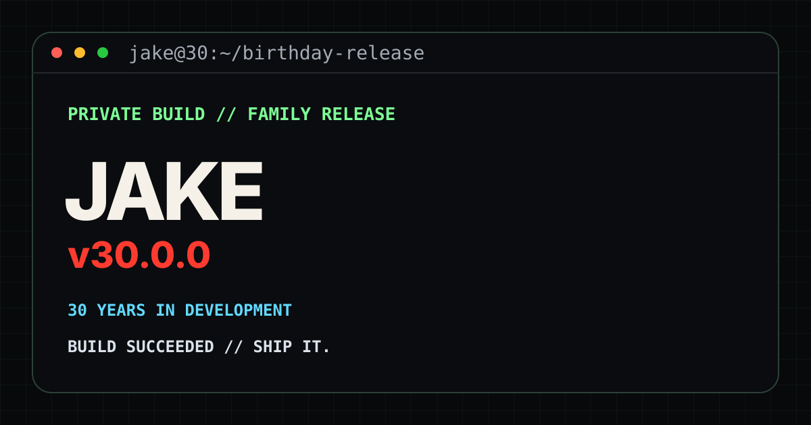

# JAKE v30.0.0

A birthday release disguised as a tiny web app.

**LIVE // PRODUCTION:** https://9teve-o.github.io/jake-v30/



## Release surface

`v30.0.1` adds server-rendered Open Graph/Twitter metadata and a 1200×630 PNG social preview while preserving the birthday experience itself as `v30.0.0`.

## Run it

No build step. No dependencies.

Open `app.html` directly, or run a tiny local server:

```bash
python -m http.server 8000
```

Then visit `http://localhost:8000`.

## GitHub Pages

Production is deployed from `main` at the repository root.

The site is plain HTML, CSS and JavaScript. The birthday hero photo is embedded directly in `app.html` so the live build has no image-path dependency. The airhorn is synthesised in the browser with Web Audio; there is no copyrighted audio file.

## Files

- `index.html` — canonical release/share surface with Open Graph and Twitter metadata
- `app.html` — preserved birthday experience
- `styles.css` — layout, responsive design and animation
- `script.js` — boot sequence, airhorn, confetti and developer-mode test
- `30-for-30.md` — hidden coding/ChatGPT/GitHub birthday extra
- `social-card.png` — 1200×630 raster preview for social sharing
- `social-card.svg` — release artwork for the repository surface
- `404.html` — branded recovery route instead of a dead end
- `robots.txt` + `sitemap.xml` — crawl boundary for the public release

## Jake

If you're reading this because you opened the repository instead of just looking at the card: correct.

Fork it. Break it. Improve it.
